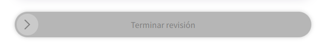
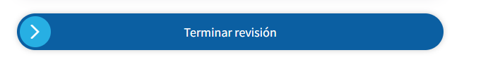
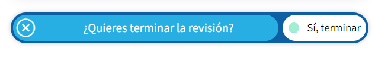
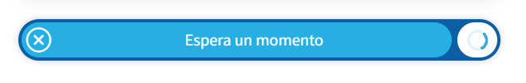
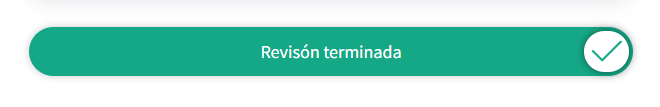

# Componente swithABV
## Descripción

Botón tipo switch que activa una función similar a la libreria Swalfire.
La intención del boton es mejorar la intereacción con el usuario y se pueda activar un función especifica en la web. Al hacer click en el boton se podrán observar los estados de este botón que también son completamente configurables. Este componente ha sido desarrollado para facilitarnos la integración en futuros proyectos que se requiera el mismo botón.
Cuenta con una promesa para que después se pueda ejecutar otro tipo de lógica
al recibir el click de confirmación.








## Importación

Para lograr el funcionamiento del componente es importante agregar los siguientes archivos:

```

switchABV.css
switchABV.js
```
Para la creación de la plantilla es importante agregar el siguiente div en el html donde se utilizará.


``` html
<div id="SwitchABV"></div>
```


## Descripción de las configuraciones del componente:

**Configurable**: Permite asignar una configuración a cada uno de los contenedores:
1. [Contenedor nodo.](#Contenedor-nodo) :   Contenedor padre.
2. [Contenedor uno.](#Contenedor-uno)   :   Botón izquierdo.
3. [Contenedor dos.](#Contenedor-dos)   :   Botón derecho.

- Cada contenedor maneja su propia configuración.

**Contenedor nodo** es el contenedor padre, es donde se crea el div y se crean los botones uno y dos con unas medidas asignadas. Puede controlar el color de fondo o agregar un texto inicial.

Si los valores no se agregan se asignarán de forma automática.


``` javascript
UseSwithButtonABV({
  configurable: {
    content_node: {
      backgroundText: string || null,
      IniText: string || null,
    },
    ...
 })
```


**Contenedor uno** puede manipular el mensaje de confirmación al desplazar el botón.
Opcional: Se puede cambiar la apariencia del botón izquierdo ajustando el color de fondo, color de texto y color de icono.

Si los valores no se agregan se asignarán de forma automática.

``` javascript
UseSwithButtonABV({
  configurable: {
    ...
    content_one_button: {
    IniText:  string required,
    useColor: {
            backgroundIco: string || null,
            backgroundText: string || null,
            colorText: string || null
        }
    },
    ...
 })
```

**Contenedor dos** puede manipular el mensaje de aceptación.
Opcional: Se puede cambiar la apariencia del botón derecho ajustando el color de fondo y color de texto.

Si los valores no se agregan se asignarán de forma automática.

``` javascript
UseSwithButtonABV({
  configurable: {
    ...
    ...
    content_two_button: {
        IniText:  string required,
        useColor: {
            backgroundText: string || null,
            colorText: string || null
        }
    }

 })
```


**Opciones** puede manipular las acciones del botón como por ejemplo mostrar o deshabilitar el botón.

Si los valores no se agregan se asignarán de forma automática.

``` javascript
UseSwithButtonABV({
  configurable: {
    ...
    ...
    ...
    options: {
        show: true,
        disableButton: false,
    },

 })
```

## Evento click confirmación

Cuando el usuario confirme el botón automáticamente tendremos una promesa como respuesta en booleano.

``` javascript
UseSwithButtonABV({
  configurable: {
    ...
    ...
    ...
    ...
 }).then((response) => {

 })
```

## ¿Necesitamos una lógica distanta despues de la acción?

Después de que el usuario haga hecho click necesitaremos agregar un evento ya sea enviar una respuesta o pasar a otro proceso para ello se puede escribir debajo del response, aunque yo recomendaría tener un método para encapsular una nueva lógica.

``` javascript
UseSwithButtonABV({
  configurable: {
    ...
    ...
    ...
    ...
 }).then((response) => {

 })
```


## ¿Necesitamos indicar que el proceso termino?

Para indicarle al usuario que el proceso ha finalizado es importante agregar el metodo SwithButtonABVFinished para cambiar el estado del botón.

``` javascript
SwithButtonABVFinished();
```

## ¿Necesitamos cambiar los estados de finalizado?

Si necesitamos cambiar el texto o color de fondo para indicarle al usuario que ha finalizado el proceso podemos utilizar el mismo método anteriormente visto y pasarle unos parámetros extra.

``` javascript
SwithButtonABVFinished({
    configurable: {
        content_node: {
            success: 'yellow',
		    IniText: 'Revisión terminada'
        },
    },
})

```

## Usando el SwitchABV

> Ejemplo 1:
En la promesa simulamos una carga a través de una petición para después disparar el evento SwithButtonABVFinished.

``` javascript
UseSwithButtonABV({
    configurable: {
        content_one_button: {
            IniText:  '¿Finalizar proceso?',
        },
        content_two_button: {
            IniText:  'Sí, continuar',
        }
    },
}).then((response) => {
    setTimeout(() => {
        SwithButtonABVFinished();
    }, 5000); 
})
```

> Ejemplo 2:

Ajustamos los parámetros para cambiar los estados de finalizado

``` javascript
UseSwithButtonABV({
    configurable: {
        content_one_button: {
            IniText:  '¿Finalizar proceso?',
        },
        content_two_button: {
            IniText:  'Sí, continuar',
        }
    },
}).then((response) => {
    setTimeout(() => {
        SwithButtonABVFinished({
            configurable: {
                content_node: {
                    success: '#ff00a3',
                    IniText: 'Revisión terminada'
                },
            },
        })
    }, 5000); 
})
```

> Ejemplo 3:

Usando todos los parámetros

``` javascript
UseSwithButtonABV({
    configurable: {
        content_node: {
            backgroundText: '#70a0ab',
            IniText: 'Enviar resultado'
        },
        content_one_button: {
            IniText:  '¿Finalizar proceso?',
            useColor: {
                backgroundIco: 'purple',
                backgroundButton: 'purple',
                colorText: 'white'
            }
        },
        content_two_button: {
            IniText:  'Sí, continuar',
            useColor:{
                backgroundText: 'black',
                colorText: 'white'
            }
        }
    },
    options: {
        show: true,
        disableButton: false,
    },
}).then((response) => {
        setTimeout(() => {
            SwithButtonABVFinished({
                configurable: {
                    content_node: {
                        success: '#ff00a3',
                        IniText: 'Revisión terminada'
                    },
                },
            })

    }, 5000); 
});

```